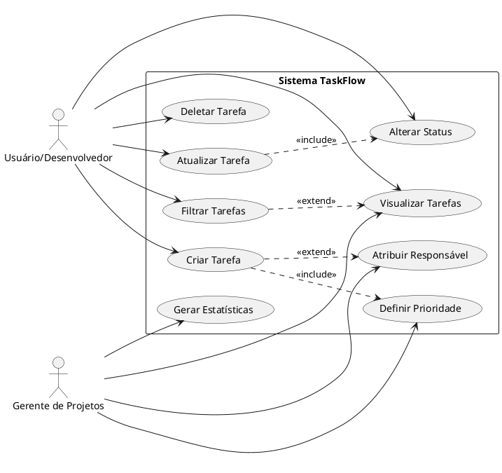

# Diagrama de Casos de Uso - TaskFlow

## Representação PlantUML

## Descrição dos Casos de Uso

### UC1 - Criar Tarefa
**Ator:** Usuário/Desenvolvedor
**Descrição:** Permite criar uma nova tarefa no sistema
**Pré-condição:** Sistema disponível
**Fluxo Principal:**
1. Usuário acessa formulário de criação
2. Preenche título (obrigatório)
3. Preenche descrição, prioridade, responsável (opcional)
4. Sistema valida dados
5. Sistema cria tarefa com ID único
6. Sistema exibe confirmação

**Pós-condição:** Tarefa criada e adicionada ao quadro Kanban

### UC2 - Visualizar Tarefas
**Ator:** Usuário/Desenvolvedor, Gerente de Projetos
**Descrição:** Exibe todas as tarefas organizadas por status no quadro Kanban
**Pré-condição:** Sistema disponível
**Fluxo Principal:**
1. Usuário acessa sistema
2. Sistema carrega todas as tarefas
3. Sistema organiza por status (A Fazer, Em Progresso, Concluído)
4. Sistema exibe quadro Kanban visual

**Pós-condição:** Tarefas exibidas

### UC3 - Atualizar Tarefa
**Ator:** Usuário/Desenvolvedor
**Descrição:** Modifica informações de uma tarefa existente
**Pré-condição:** Tarefa existe no sistema
**Fluxo Principal:**
1. Usuário seleciona tarefa
2. Modifica campos desejados
3. Sistema valida dados
4. Sistema atualiza tarefa
5. Sistema exibe confirmação

**Pós-condição:** Tarefa atualizada

### UC4 - Deletar Tarefa
**Ator:** Usuário/Desenvolvedor
**Descrição:** Remove uma tarefa do sistema
**Pré-condição:** Tarefa existe no sistema
**Fluxo Principal:**
1. Usuário seleciona tarefa
2. Usuário confirma exclusão
3. Sistema remove tarefa
4. Sistema atualiza visualização

**Pós-condição:** Tarefa removida

### UC5 - Filtrar Tarefas (Nova Funcionalidade - Sprint 2)
**Ator:** Usuário/Desenvolvedor
**Descrição:** Filtra tarefas por status, prioridade ou responsável
**Pré-condição:** Sistema disponível
**Fluxo Principal:**
1. Usuário seleciona critérios de filtro
2. Sistema aplica filtros
3. Sistema exibe tarefas filtradas

**Pós-condição:** Tarefas filtradas exibidas

### UC6 - Alterar Status
**Ator:** Usuário/Desenvolvedor
**Descrição:** Altera o status de uma tarefa (A Fazer → Em Progresso → Concluído)
**Pré-condição:** Tarefa existe
**Fluxo Principal:**
1. Usuário clica no botão de status desejado
2. Sistema atualiza status
3. Sistema move tarefa para coluna correspondente

**Pós-condição:** Status atualizado

### UC7 - Definir Prioridade
**Ator:** Gerente de Projetos
**Descrição:** Define a prioridade de uma tarefa
**Pré-condição:** Tarefa existe ou está sendo criada
**Fluxo Principal:**
1. Gerente seleciona prioridade (Baixa, Média, Alta, Crítica)
2. Sistema atualiza prioridade
3. Sistema aplica indicador visual

**Pós-condição:** Prioridade definida

### UC8 - Atribuir Responsável
**Ator:** Gerente de Projetos
**Descrição:** Atribui um membro da equipe como responsável pela tarefa
**Pré-condição:** Tarefa existe ou está sendo criada
**Fluxo Principal:**
1. Gerente informa nome do responsável
2. Sistema registra atribuição
3. Sistema exibe responsável na tarefa

**Pós-condição:** Responsável atribuído

### UC9 - Gerar Estatísticas
**Ator:** Gerente de Projetos
**Descrição:** Visualiza estatísticas do projeto (total, por status, etc.)
**Pré-condição:** Sistema disponível
**Fluxo Principal:**
1. Sistema calcula automaticamente:
   - Total de tarefas
   - Tarefas por status
   - Tarefas por prioridade
2. Sistema exibe dashboard com números

**Pós-condição:** Estatísticas exibidas

---

**Nota:** Este diagrama representa os principais casos de uso do sistema TaskFlow após a mudança de escopo que incluiu o sistema de filtros.
